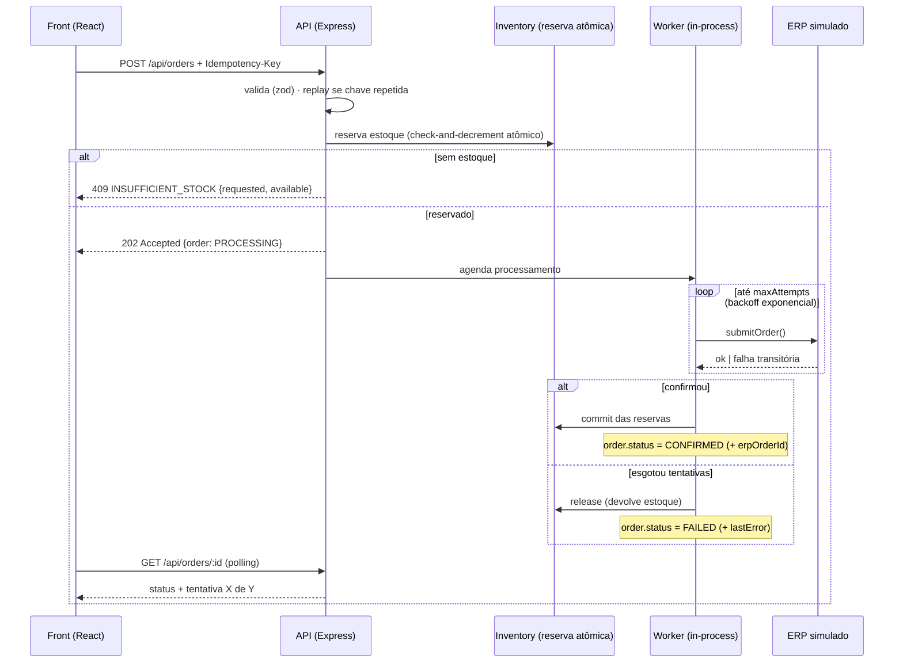

# CaseCellShop — Checkout Resiliente 🛡️📱

Mini-projeto fullstack do desafio técnico (nível pleno): vitrine + checkout que **não vende sem estoque**, **não duplica pedido** e **sobrevive a um ERP lento e instável**.

- **Backend:** Node.js + TypeScript + Express · dados em memória · ERP simulado
- **Frontend:** React + TypeScript + Vite
- O projeto está dividido em duas aplicações independentes (`backend` e `frontend`), cada uma com seu próprio `package.json`.
- **Testes:** Vitest + Supertest + Testing Library (24 testes, incluindo concorrência)
- As respostas conceituais (Parte 1.A) estão em [`RESPOSTAS.md`](./RESPOSTAS.md) e o registro de uso de IA em [`PROMPTS.md`](./PROMPTS.md).

---

## Como rodar

Pré-requisito: Node.js 20+ (testado com Node 22).

**Terminal 1 — backend (porta 3001):**

```bash
cd backend
npm install
npm run dev
```

**Terminal 2 — frontend (porta 5173):**

```bash
cd frontend
npm install
npm run dev
```

Abra <http://localhost:5173>. O Vite faz proxy de `/api` para a 3001 (sem CORS, sem URL hardcoded).

### Controlando a simulação do ERP

O ERP simulado tem latência e taxa de falha configuráveis por variável de ambiente (padrões: 400–2500ms e 35% de falha por chamada):

```bash
# Caos total: toda chamada ao ERP falha → veja retries, FAILED e estoque devolvido
ERP_FAILURE_RATE=1 npm run dev

# Mundo perfeito e rápido
ERP_FAILURE_RATE=0 ERP_MIN_LATENCY_MS=50 ERP_MAX_LATENCY_MS=100 npm run dev
```

### Testes

Após instalar as dependências conforme a seção anterior, execute:

```bash
cd backend && npm test    # 21 testes: unitários, integração da API e concorrência
cd frontend && npm test   # 3 testes de estados da UI (fetch mockado)
```

Ou, para testar direto a partir de um clone limpo:

```bash
cd backend && npm install && npm test
cd frontend && npm install && npm test
```

### Demonstrações rápidas (curl)

```bash
# Criar pedido (a chave de idempotência é obrigatória)
curl -X POST localhost:3001/api/orders \
  -H 'Content-Type: application/json' -H 'Idempotency-Key: demo-1' \
  -d '{"items":[{"productId":"case-001","quantity":2}]}'

# Acompanhar o status (PROCESSING → CONFIRMED | FAILED)
curl localhost:3001/api/orders/<id>

# Repetir o mesmo POST acima → mesmo pedido, "replayed": true (nunca duplica)
# Pedir 99 unidades de case-002 (estoque 5) → 409 INSUFFICIENT_STOCK com o disponível
```

Na UI, a **Capinha Couro Premium** tem estoque 1 (boa para ver a disputa pela última unidade) e a **Tropical Bahia** já nasce esgotada.

---

## Arquitetura do mini-projeto



### Decisões técnicas (e porquês)

**`202 Accepted` em vez de esperar o ERP.** O problema nº 3 do enunciado é exatamente o timeout síncrono. Aqui o pedido é aceito em milissegundos com o estoque já garantido; a integração com o ERP acontece num worker com retry + backoff exponencial. "Sucesso" virou "aceito + acompanhamento" — a UI mostra `Processando no ERP (2/4)…` via `GET /api/orders/:id` (bônus do endpoint de status).

**No escopo do mini-projeto, oversell é evitado por construção.** A reserva é um *check-and-decrement* numa seção crítica 100% síncrona do event loop (sem `await` entre checar e debitar) — `backend/src/services/inventory.ts` comenta o equivalente de produção (`UPDATE ... WHERE qty >= n` / script Lua no Redis com persistência/reconciliação). O teste de concorrência dispara 8 compras simultâneas da última unidade e exatamente 1 vence. Em produção, eu priorizaria o banco transacional da loja como fonte de verdade do estoque vendável; Redis pode apoiar cache, locks ou otimizações pontuais, mas não ser a única fonte persistente.

**Idempotência de verdade, não só "ignora duplicado".** `Idempotency-Key` obrigatória; o servidor guarda `chave → hash(payload canônico) + orderId`. Mesma chave + mesmo payload → replay do mesmo pedido (`replayed: true`); mesma chave + payload diferente → `409 IDEMPOTENCY_CONFLICT`. No front, a regra de ouro: **erro de rede/timeout reusa a mesma chave** ("Reenviar com segurança"); estados terminais rotacionam a chave (nova intenção de compra).

**Reservas com TTL + sweeper.** Reserva nasce no submit (`HELD`), vira `COMMITTED` na confirmação ou `RELEASED` na falha/expiração (TTL 2min, sweeper a cada 10s) — estoque nunca fica preso para sempre.

**Modelo de erros único.** Toda falha sai como `{ error: { code, message, details, traceId } }`, com `X-Trace-Id` no header e logs estruturados em JSON (bônus) correlacionáveis pelo mesmo traceId.

| HTTP | code | A UI mostra |
|---|---|---|
| 202 | — | "Processando no ERP (X/Y)…" e depois ✅/❌ |
| 400 | `VALIDATION_ERROR` | o que corrigir (issues por campo) |
| 404 | `PRODUCT_NOT_FOUND` / `ORDER_NOT_FOUND` | mensagem + recarrega vitrine |
| 409 | `INSUFFICIENT_STOCK` | "restam N unidades" (vem em `details.available`) |
| 409 | `IDEMPOTENCY_CONFLICT` | mensagem genérica + nova chave |
| 500 | `INTERNAL_ERROR` | retry com a **mesma** chave |
| 503 | `SERVICE_UNAVAILABLE` | serviço temporariamente indisponível; tentar novamente com a **mesma** chave se não houve confirmação |
| rede | — | "Reenviar com segurança" (mesma chave ⇒ não duplica) |

Falhas temporárias do ERP após o aceite do pedido não viram erro HTTP do checkout: o pedido permanece `PROCESSING` e o worker tenta novamente. O `503 SERVICE_UNAVAILABLE` fica reservado para indisponibilidade antes da criação segura do pedido/reserva, como falha do store ou de uma fila/outbox em uma versão produtiva.

**Preço sempre no servidor, sempre em centavos.** O cliente envia só `productId + quantity`; inteiros em centavos evitam os clássicos de ponto flutuante.

### Estrutura

```
backend/
  src/
    domain/      tipos e erros de negócio
    services/    inventory (reserva atômica) · checkout (idempotência) ·
                 orderProcessor (worker + retry) · erp (simulação)
    http/        validação (zod) · middlewares (traceId, cors, logs, erros)
    store/       MemoryStore + seed
    app.ts       fábrica do app (injeção p/ testes) · index.ts: bootstrap
  tests/         unitários · integração (ERP fake) · concorrência
frontend/
  src/
    api.ts           cliente HTTP + ApiError rico
    useCheckout.ts   máquina de estados da compra + ciclo de vida da chave
    components/      ProductCard (stepper, loading, painéis por tipo de erro)
    App.test.tsx     testes de estado da UI
RESPOSTAS.md   Parte 1.A · PROMPTS.md · README.md
```

### Mapeamento do checklist do desafio

| Item esperado | Onde |
|---|---|
| API de produtos / tentativa de compra | `GET /api/products`, `POST /api/orders` |
| Validação de entradas | zod + header obrigatório → `400` com issues |
| Diferencia sucesso/validação/estoque/falha técnica | tabela de erros acima + testes |
| Evita oversell | reserva atômica + `tests/concurrency.test.ts` |
| Anti pedido duplicado | `Idempotency-Key` (replay/conflict) + botão travado |
| ERP lento/instável simulado | `services/erp.ts` (latência 0,4–2,5s · 35% falha · env-configurável) |
| Tela de produtos + quantidade + compra | vitrine com stepper por card |
| Loading e anti multi-clique | botão desabilitado + spinner + "tentativa X/Y" |
| Mensagens por tipo de erro | painéis de status por estado |
| Estado coerente após erro/retry | hook `useCheckout` + teste de reabilitação |
| README / decisões / limitações / próximos passos | este arquivo |
| Testes | 24 automatizados |
| **Bônus** | diagrama ✓ · logs estruturados ✓ · endpoint de status ✓ · teste de concorrência ✓ |

---

## Limitações conscientes

- **Tudo em memória, um único processo.** Reiniciou, zerou. A atomicidade vem do event loop do Node — vale para 1 nó; com réplicas, a seção crítica migra para o banco transacional da loja (`UPDATE ... WHERE qty >= n`) ou Redis com script Lua, persistência e reconciliação (os comentários no código indicam exatamente como).
- **Worker in-process, não fila real.** Sem persistência da "fila": se o processo cair com pedidos `PROCESSING`, eles ficam órfãos (em produção: outbox + broker + DLQ).
- **TTL da reserva vs. tempo do worker.** No mini-projeto, o TTL da reserva (2 min) foi configurado acima do pior caso do worker (4 tentativas × backoff + latência máxima do ERP ≈ 14s com os padrões), então uma reserva não expira com o pedido ainda em processamento. Se as latências forem aumentadas via env além desse limite, abre-se uma janela teórica: o sweeper libera a reserva e uma confirmação tardia do ERP marcaria o pedido `CONFIRMED` com o estoque já devolvido. Em produção, o worker também deveria validar se a reserva continua `HELD` antes de confirmar, evitando confirmação tardia de reserva já expirada.
- **Polling, não push.** O front consulta o status a cada 800ms; em produção, SSE/WebSocket ou webhook.
- **Store de idempotência sem expiração.** Cresce para sempre; em produção, TTL de ~24h por chave.
- **Sem autenticação/pagamento** (fora do escopo declarado do desafio).

## Próximos passos

1. Postgres com `UPDATE ... WHERE qty >= n` + UNIQUE na chave de idempotência (mesmas invariantes, agora multi-nó).
2. Outbox + fila gerenciada + DLQ para a integração com o ERP; circuit breaker.
3. Job de reconciliação loja↔ERP (físico − reservas vs vendável) com alertas.
4. Contrato OpenAPI como fonte única (tipos do front gerados; teste de contrato executável).
5. SSE para status do pedido; testes E2E (Playwright) e de carga (k6).
