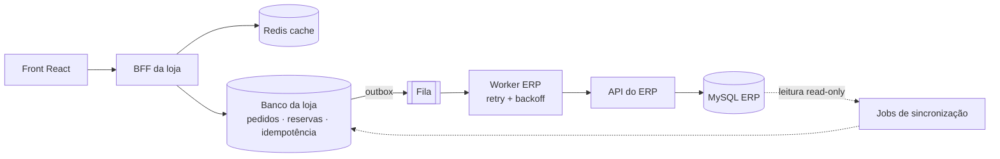

# Parte 1.A — Respostas Conceituais

> Desafio Técnico CaseCellShop · Nível Pleno · Fullstack
> As decisões abaixo estão **implementadas em escala reduzida** no mini-projeto da Parte 1.B — os trechos `código:` apontam onde.

---

## Pergunta 1 — Diagnóstico e trade-offs

### 01 · Performance da vitrine

**Causa provável.** A loja consulta o ERP **sincronamente a cada acesso**. O ERP é um monolito otimizado para back-office (faturamento, contábil), não para milhões de leituras concorrentes: queries pesadas no MySQL, sem cache, latência somada na cadeia loja → ERP → MySQL. Em hipercrescimento, a vitrine herda toda a lentidão e a fila de conexões do ERP.

**Impacto.** Cliente: segundos de tela em branco logo no início da jornada → abandono. Negócio: queda de conversão e de SEO, e o pior — **tráfego de vitrine compete pelos mesmos recursos do ERP que processa pedidos**, degradando tudo junto.

**Caminhos possíveis.**

1. **Cache de leitura (Redis/CDN) na frente do ERP**, com TTL curto (30–120s) e invalidação por evento/job.
   - *Prós:* ganho imediato (de segundos para ms), risco baixo, não toca o ERP.
   - *Contras/riscos:* dado pode ficar levemente defasado (preço/estoque); exige política de invalidação e tratamento de *cache stampede* (ex.: lock de revalidação).
2. **Read model próprio da loja**: banco da loja (Postgres/Mongo) alimentado por sincronização a partir do MySQL do ERP (temos acesso de leitura); a vitrine só lê desse banco.
   - *Prós:* desacopla de vez a leitura, permite modelar para a vitrine (busca, facetas), base para tudo que vem depois.
   - *Contras/riscos:* infraestrutura nova + pipeline de sync para manter; consistência eventual explícita.
3. (Complementar) **CDN/edge cache para o HTML e assets** das páginas de listagem.

**Prioridade.** Caminho 1 primeiro (dias, não semanas, e tira pressão do ERP **hoje**), evoluindo para o caminho 2 — o cache vira uma camada na frente do read model, não um remendo permanente.

### 02 · Consistência de estoque (oversell)

**Causa provável.** O fluxo é **ler estoque → decidir → gravar**, sem atomicidade: dois clientes leem "resta 1" ao mesmo tempo e ambos compram (race condition clássica de *check-then-act*). Agrava: estoque lido de cache/tela defasada e ausência de reserva entre "adicionou ao carrinho" e "faturou no ERP".

**Impacto.** Cliente: compra confirmada e depois cancelada — quebra de confiança difícil de reverter. Negócio: estorno, custo de SAC, reputação, risco com órgãos de defesa do consumidor.

**Caminhos possíveis.**

1. **Decremento atômico condicional** no ponto de verdade da loja: `UPDATE stock SET qty = qty - :n WHERE id = :id AND qty >= :n` (ou `DECR` com checagem em script Lua no Redis). Se afetou 0 linhas → estoque insuficiente.
   - *Prós:* elimina o oversell na raiz; simples de raciocinar e testar.
   - *Contras:* exige que a loja tenha autoridade sobre o "estoque vendável" (não dá para fazer isso dentro do ERP, que não podemos alterar).
2. **Reserva com expiração (soft hold)**: ao iniciar o checkout cria-se uma reserva com TTL; confirmou → vira baixa definitiva; abandonou/falhou → devolve.
   - *Prós:* experiência justa ("o item é seu por X minutos"), evita segurar estoque para sempre.
   - *Contras:* mais estados para gerenciar (HELD/COMMITTED/RELEASED), precisa de um *sweeper* de expiração.
3. **Lock pessimista por produto** (SELECT ... FOR UPDATE / lock distribuído).
   - *Prós:* correto.
   - *Contras:* serializa demais sob alta concorrência em produtos quentes; deadlocks; pior custo/benefício aqui.

**Prioridade.** 1 + 2 **combinados** (o decremento atômico *é* a criação da reserva). É o que o mini-projeto implementa — `código: backend/src/services/inventory.ts`.

### 03 · Resiliência do checkout

**Causa provável.** O checkout espera **sincronamente** o ERP gerar faturamento — operação naturalmente lenta — dentro do timeout da requisição HTTP do cliente. Qualquer pico/instabilidade do ERP estoura o timeout e o cliente "perde" a compra (que às vezes até foi processada → pedido fantasma/duplicado no retry).

**Impacto.** Cliente: erro na pior hora possível, no momento de pagar. Negócio: perda direta de receita no fundo do funil + pedidos duplicados quando o cliente tenta de novo.

**Caminhos possíveis.**

1. **Checkout assíncrono**: a loja valida, **reserva estoque**, persiste o pedido como `PROCESSING` e responde `202` em milissegundos; um worker integra com o ERP com **retry + backoff**; o front acompanha por polling/webhook.
   - *Prós:* o cliente nunca espera o ERP; falhas viram tentativas, não erros; combina com idempotência.
   - *Contras:* "sucesso" vira "aceito" (mudança de UX/contrato); exige status de pedido e comunicação clara.
2. **Manter síncrono com timeout maior + retry no gateway + circuit breaker.**
   - *Prós:* mexe menos no contrato.
   - *Contras:* só empurra o problema; conexões presas em pico derrubam a loja junto; retry síncrono sem idempotência **cria** pedidos duplicados.
3. (Evolução de 1) **Fila persistente (outbox + broker)** entre loja e ERP, com DLQ para falhas permanentes.

**Prioridade.** Caminho 1 já — é o coração do mini-projeto (`código: backend/src/services/orderProcessor.ts`) — evoluindo a "fila em memória" para broker real (caminho 3) quando houver mais de um nó.

---

## Pergunta 2 — Arquitetura alvo incremental

### Componentes

| Componente | Papel |
|---|---|
| **BFF / API da loja** (Node+TS) | Única porta da loja; valida, aplica idempotência, orquestra. O front nunca fala com o ERP. |
| **Banco da loja** (Postgres) | Pedidos, reservas, chaves de idempotência, **estoque vendável** (autoridade da loja). |
| **Cache** (Redis) | Catálogo/preço para a vitrine (TTL curto), proteção contra *cache stampede* e otimizações pontuais. Para estoque, pode apoiar operações quentes, mas a fonte de verdade do **estoque vendável** permanece no banco transacional da loja. |
| **Fila** (outbox na loja → SQS/Rabbit) | Desacopla o checkout da integração com o ERP. |
| **Workers** | Consomem a fila: enviam pedido ao ERP com retry/backoff, confirmam ou liberam reservas. |
| **Jobs de sincronização** | Leem o MySQL do ERP (acesso read-only que já temos) e atualizam catálogo/estoque base da loja; reconciliação periódica. |
| **Observabilidade** | Logs estruturados com `traceId` por requisição/pedido, métricas (fila, taxa de falha ERP, oversell=0) e alertas. |

### Fluxos de dados

- **Produtos (leitura):** Front → BFF → Redis (hit ~ms) → *miss* → banco da loja → resposta + repovoa cache. Job de sync mantém o banco da loja atualizado por **polling incremental** nas tabelas/visões disponíveis do ERP. Em uma evolução, CDC/binlog seria uma opção melhor, desde que autorizada pelo time responsável pelo ERP. O ERP sai do caminho da requisição.
- **Estoque:** o ERP continua dono do **estoque físico/contábil**; a loja é dona do **estoque vendável** (= físico sincronizado − reservas ativas). Toda venda decrementa o vendável **atomicamente** na loja.
- **Checkout (escrita):** Front (com `Idempotency-Key`) → BFF: valida → replay se chave repetida → **reserva atômica** → grava pedido `PROCESSING` + evento na **outbox** (mesma transação) → `202`. Worker lê a outbox → fila → chama ERP com retry → `CONFIRMED` (commit da reserva) ou `FAILED` (libera reserva e devolve estoque). Front acompanha em `GET /orders/:id`.

### Plano 30–90 dias

- **Dias 0–30 (parar o sangramento):** cache Redis na vitrine; logs estruturados + traceId; tabela de estoque vendável na loja com decremento atômico no checkout (mata o oversell); `Idempotency-Key` obrigatória no checkout.
- **Dias 30–60 (desacoplar o checkout):** pedido `PROCESSING` + `202` + worker com retry/backoff + endpoint de status; reservas com TTL e sweeper; front com estados de processamento e mensagens por tipo de erro. *(→ é exatamente o escopo do mini-projeto.)*
- **Dias 60–90 (robustez):** outbox + broker gerenciado + DLQ; job de reconciliação loja↔ERP com relatório de divergências; circuit breaker para o ERP; dashboards e alertas (profundidade de fila, taxa de falha, idade do pedido mais antigo em `PROCESSING`).



---

## Pergunta 3 — Estoque, concorrência e idempotência

**Dois clientes, última unidade.** A decisão acontece em **uma única operação atômica** de *check-and-decrement* no ponto de verdade (`UPDATE ... WHERE qty >= n` / Lua no Redis). Não existe janela entre "ler" e "gravar": o primeiro decrementa para 0; o segundo afeta 0 linhas e recebe `409 INSUFFICIENT_STOCK`. No mini-projeto, a seção crítica é 100% síncrona dentro do event loop do Node (sem `await` entre checar e debitar), o que dá a mesma garantia em escala de demonstração — os comentários em `inventory.ts` mapeiam o equivalente de produção. O teste `tests/concurrency.test.ts` dispara 8 compras simultâneas da última unidade e prova que exatamente 1 passa.

**Reserva: quando nasce e quando morre.** Nasce **no submit do checkout** (não no carrinho — carrinho reservando estoque em site de alto tráfego vira arma de negação de estoque). Estados: `HELD` → `COMMITTED` (ERP confirmou) ou `RELEASED` (falha definitiva ou expiração). TTL de ~2 minutos cobre o pior caso do worker (tentativas × backoff); um sweeper periódico libera reservas `HELD` vencidas e devolve o estoque.

**Retry, timeout e duplo clique.**
- *Duplo clique:* o front desabilita o botão durante o processamento (1ª camada) **e** envia a mesma `Idempotency-Key` (2ª camada) — mesmo que dois POSTs cheguem, o servidor cria um único pedido.
- *Timeout/queda de rede:* o cliente **não sabe** se o pedido foi criado. Regra de ouro do front: reenviar com a **mesma chave e o mesmo payload**. Se o pedido existe → replay (200/202 com o mesmo pedido, `replayed: true`); se não existe → cria agora. Nunca duplica.
- *Retry do worker para o ERP:* backoff exponencial com máximo de tentativas; esgotou → `FAILED` + reserva liberada + estoque devolvido (o cliente vê "tentar novamente", que é uma **nova** intenção, com chave nova).

**Idempotência (servidor).** Chave → registro `{hash(payload canônico), orderId}`. Mesma chave + mesmo hash → retorna o pedido existente. Mesma chave + payload diferente → `409 IDEMPOTENCY_CONFLICT` (uso incorreto do cliente, nunca silenciar). Em produção a unicidade vem de uma *constraint* UNIQUE na tabela de chaves — empates de corrida viram conflito de inserção resolvido pelo banco. `código: backend/src/services/checkout.ts`.

**Reconciliação loja↔ERP.** O ERP é a fonte da verdade do **físico**; a loja, do **vendável**. Job periódico compara `estoque_físico(ERP) − reservas_ativas(loja)` vs `vendável(loja)`: divergência pequena → ajusta o vendável e loga; divergência grande/recorrente → alerta humano. Pedidos `PROCESSING` velhos demais entram num relatório de "limbo" para verificação manual contra o ERP (o `erpOrderId` salvo em cada confirmação permite o de-para). Direção conservadora: na dúvida, **reduzir** o vendável — vender a menos por minutos custa menos que vender o que não existe.

---

## Pergunta 4 — Contrato de API e modelo de erros

*(Contrato implementado e testado no mini-projeto.)*

### `POST /api/orders`

Headers: `Content-Type: application/json` · **`Idempotency-Key: <uuid>` (obrigatório)**

```json
{ "items": [ { "productId": "case-001", "quantity": 2 } ] }
```

O cliente **nunca envia preço** — o servidor lê do catálogo (evita adulteração).

### Respostas

**Sucesso (aceito) — `202 Accepted`** · a confirmação no ERP é assíncrona:

```json
{
  "order": {
    "id": "5f0c…", "status": "PROCESSING",
    "items": [{ "productId": "case-001", "name": "Capinha Silicone Soft", "quantity": 2, "unitPriceCents": 4990 }],
    "totalCents": 9980, "attempts": 0, "maxAttempts": 4,
    "createdAt": "…", "updatedAt": "…"
  },
  "replayed": false
}
```

`replayed: true` indica replay idempotente (mesma chave). `GET /api/orders/:id` devolve o pedido com `status ∈ {PROCESSING, CONFIRMED, FAILED}`, `attempts`, `lastError?`, `erpOrderId?`.

**Erros — envelope único** `{ "error": { "code", "message", "details?", "traceId" } }`:

| HTTP | `errorCode` | Quando | Reação do front |
|---|---|---|---|
| 400 | `VALIDATION_ERROR` | payload inválido / sem `Idempotency-Key` (`details.issues[]` campo a campo) | Mensagem no campo/card; **rotaciona** a chave; não re-tenta sozinho. |
| 404 | `PRODUCT_NOT_FOUND` | produto inexistente | Mensagem + recarrega vitrine. |
| 409 | `INSUFFICIENT_STOCK` | estoque vendável < pedido (`details: {productId, requested, available}`) | Mostra o disponível ("restam 2"), atualiza vitrine, deixa ajustar; rotaciona a chave. |
| 409 | `IDEMPOTENCY_CONFLICT` | mesma chave, payload diferente | Tratar como bug do cliente: nova chave + mensagem genérica. |
| 500 | `INTERNAL_ERROR` | falha inesperada após a API receber a requisição | "Algo deu errado", oferecer retry **com a mesma chave**. |
| 503 | `SERVICE_UNAVAILABLE` | indisponibilidade antes da criação segura do pedido/reserva (ex.: store/fila indisponível) | Informar indisponibilidade temporária; se o cliente não recebeu confirmação, tentar novamente com a **mesma chave**. |
| — | *(timeout / queda de rede)* | sem resposta | **Reenviar com a mesma chave e o mesmo payload** — o replay garante não-duplicação. |

A "falha temporária do ERP" **não é erro HTTP do checkout quando o pedido já foi aceito**: a API retorna `202` e o retry acontece no servidor. Se todas as tentativas falham, `GET /orders/:id` devolve `status: FAILED` + `lastError`, estoque já devolvido — o front mostra "o ERP não confirmou; nada foi cobrado" com botão de tentar novamente (nova intenção ⇒ nova chave). `503 SERVICE_UNAVAILABLE` fica reservado para falhas antes da criação segura do pedido/reserva, como indisponibilidade do store ou da fila/outbox.

---

## Pergunta 5 — Testes e estratégia de validação

**Unitários (regras puras, sem HTTP).** `InventoryService`: decremento exato, falha com `requested/available`, release idempotente, commit definitivo, expiração só de `HELD` vencidas, impossibilidade de saldo negativo. Hash canônico de payload (ordem dos itens não altera o hash). → `tests/inventory.test.ts`.

**Integração da API (supertest + ERP fake determinístico).** Sobe o app real com `FakeErp` injetado (plano `['fail','fail','ok']` etc.) e percorre: fluxo feliz `202 → CONFIRMED`; validações (quantity 0, JSON malformado, sem header); `INSUFFICIENT_STOCK` sem efeito colateral; replay idempotente; `IDEMPOTENCY_CONFLICT`; retry que recupera; falha definitiva com **devolução de estoque**. → `tests/checkout.api.test.ts`.

**Concorrência (bônus, automatizado).** `Promise.all` com N requisições reais simultâneas: 8 disputando a última unidade (exatamente 1 vence), 20 disputando 5 (exatamente 5), e rajada de 10 com a **mesma** chave (1 pedido só, estoque debitado 1×). → `tests/concurrency.test.ts`.

**Contrato front↔back.** Hoje: tipos TS espelhados (`frontend/src/types.ts`) + os testes de integração fixam o shape das respostas (qualquer mudança quebra a suíte). Próximo passo documentado: OpenAPI como fonte única, gerando os tipos do front e validando respostas nos testes (contrato executável) — ou Pact se os times se separarem.

**Estados do front (Testing Library, fetch mockado).** Render da vitrine; compra feliz com asserção de que o **header `Idempotency-Key` foi enviado** e de que o botão fica desabilitado durante o processamento; `409` de estoque exibindo "restam N" e **reabilitando** o botão (estado coerente pós-erro). → `frontend/src/App.test.tsx`.

**Automatizo agora vs documento.** Agora (está no repo): tudo acima, rodando com `npm test` em cada pasta. Documentado como próximo passo: teste de carga (k6) na vitrine e no checkout; chaos testing da integração ERP; contrato OpenAPI executável; E2E com Playwright (front real + back real + ERP simulado); teste do sweeper com clock fake.

---

## Pergunta 6 — Uso de IA no desenvolvimento

**Como usei aqui.** Este projeto foi construído em par com IA (Claude) — o registro honesto está em `PROMPTS.md`. O padrão de prompt que funciona: **contexto + restrições + critérios de aceite**, não "faça um e-commerce". Ex.: *"API Node+TS de checkout; estoque não pode ficar negativo sob concorrência; `Idempotency-Key` com replay e conflito 409; ERP simulado com latência/falha configuráveis; escreva primeiro os testes de concorrência que provam a ausência de oversell."*

**Delego à IA:** boilerplate (configs, tipos, wiring de rotas), primeira versão de testes a partir de cenários que eu defino, CSS/layout, documentação inicial, geração de casos de borda que eu não listei.

**Não delego:** as **decisões** (síncrono vs assíncrono, onde mora a verdade do estoque, contrato de erros) — IA propõe, eu decido; e as **invariantes críticas** (a seção atômica do estoque, o ciclo de vida da chave de idempotência) — essas eu reviso linha a linha, porque são exatamente os pontos onde um código plausível e errado passa despercebido.

**Como verifico:** (1) testes automatizados que **eu** especifico antes — em especial os de concorrência, que é onde IA mais erra de forma convincente; (2) execução real com cenários forçados (`ERP_FAILURE_RATE=1` → todo pedido deve terminar `FAILED` com estoque devolvido; `=0` → tudo confirma); (3) leitura crítica do diff como num code review de terceiro; (4) checagem de versões/APIs contra a documentação oficial (IA inventa API com confiança).

**Riscos de aceitar sem revisão:** código plausível porém sutilmente errado (race conditions que só aparecem sob carga real); APIs/configurações alucinadas; falsa sensação de cobertura (testes que passam mas não testam a invariante); vulnerabilidades clássicas reintroduzidas; e o risco humano — não saber explicar o próprio código. Regra prática: **IA acelera a digitação; a responsabilidade pela engenharia continua sendo minha.**
